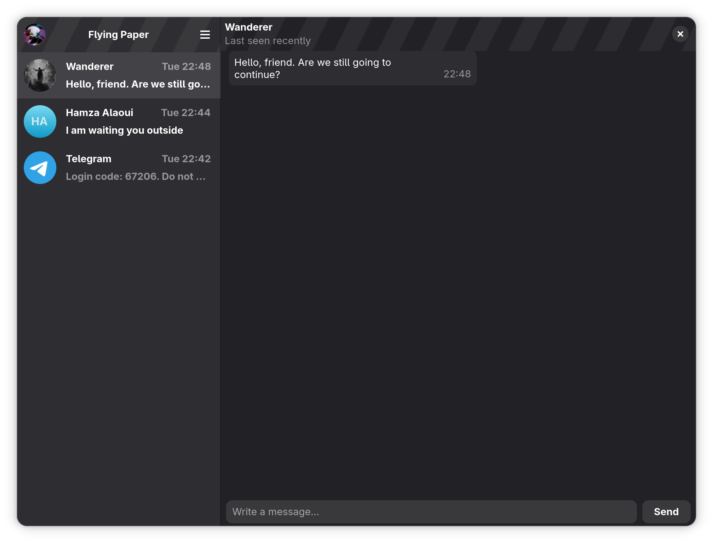

# Flying Paper

A Telegram client built with GTK4 and libadwaita.



**Under development** — early stage, contributions welcome.

## Dependencies

- **peel** — C++ GObject bindings (https://gitlab.gnome.org/bugaevc/peel)
- **gtk4** — ≥ 4.0
- **libadwaita** — ≥ 1.5
- **gdk-pixbuf** — ≥ 2.0
- **TDLib** — Telegram Database Library (with C++ headers)
- **sqlite3**, **openssl**, **zlib**

## Building

### 1. Install dependencies

```sh
# Fedora
dnf install meson gcc-c++ gtk4-devel libadwaita-devel gdk-pixbuf2-devel \
  sqlite-devel openssl-devel zlib-devel tdlib-devel

# Debian/Ubuntu
apt install meson g++ libgtk-4-dev libadwaita-1-dev libgdk-pixbuf-2.0-dev \
  libsqlite3-dev libssl-dev zlib1g-dev libtd-dev
```

### 2. Build and install peel

```sh
git clone https://gitlab.gnome.org/bugaevc/peel.git
cd peel
meson setup build
ninja -C build
sudo ninja -C build install
```

### 3. Get Telegram API credentials

Register your application at https://my.telegram.org to obtain an **API ID** and **API hash**.

### 4. Configure and build

```sh
git clone https://github.com/your-username/flying-paper.git
cd flying-paper
meson setup build -Dtelegram_app_id=YOUR_API_ID -Dtelegram_app_hash=YOUR_API_HASH
ninja -C build
```

### 5. Run

```sh
./build/flying-paper
```

### 6. Install system-wide

```sh
sudo ninja -C build install
```

## License

Flying Paper is free software: you can redistribute it and/or modify
it under the terms of the GNU General Public License as published by
the Free Software Foundation, either version 3 of the License, or
(at your option) any later version.
